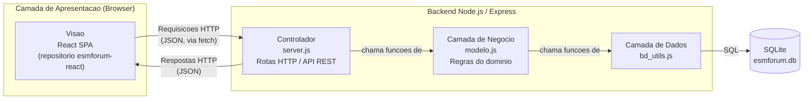

# Análise Arquitetural — ESM Forum

Análise da arquitetura atual do sistema ESM Forum, conforme a Tarefa 5 da
Parte 3 do Projeto Final da disciplina de Engenharia de Software.

- **Aluno:** Vinicius da Costa Chaves

---

## a) Identificação da Arquitetura

### Estilos arquiteturais seguidos pelo sistema

O ESM Forum combina dois estilos arquiteturais complementares:

1. **Cliente-Servidor**: o frontend (`esmforum-react`) e o backend
   (`esmforum`) são dois projetos/repositórios completamente separados,
   que rodam em processos e portas diferentes (frontend na porta 3000,
   backend na porta 5000) e se comunicam apenas por requisições HTTP.

2. **MVC (variação)**: essa é, inclusive, a arquitetura declarada pelo
   próprio projeto original em `docs/arquitetura.md`. É uma variação do
   MVC em que a **Visão** roda inteiramente no browser (como uma Single
   Page Application em React), enquanto o **Controlador** e o **Modelo**
   rodam no servidor:
   - **Visão**: a SPA React (repositório `esmforum-react`).
   - **Controlador**: `server.js`, que expõe uma API REST via Express e
     faz a mediação entre a Visão e o Modelo.
   - **Modelo**: `modelo.js`, que implementa as regras de negócio e o
     acesso a dados (junto com `bd_utils.js`).

Dentro do backend, essa organização também pode ser lida como uma
**arquitetura em camadas (layered architecture)**: cada arquivo tem uma
camada bem definida, e uma camada só se comunica com a camada
imediatamente abaixo dela (`server.js` → `modelo.js` → `bd_utils.js` →
SQLite), sem "pular" camadas.

### Camadas existentes

| Camada | Onde está | Responsabilidade |
|---|---|---|
| **Apresentação** | `esmforum-react` (repositório separado) | Renderizar a UI, capturar interações do usuário (cliques, formulários) e chamar a API via `fetch` |
| **Apresentação/Controle (lado servidor)** | `server.js` | Expor rotas HTTP, interpretar requisições, chamar o Modelo, formatar respostas JSON e códigos de status |
| **Negócio** | `modelo.js` | Regras do domínio do fórum (listar, cadastrar, buscar perguntas e respostas) |
| **Dados** | `bd/bd_utils.js` + SQLite (`bd/esmforum.db`) | Execução de queries SQL e persistência dos dados |

### Como o frontend e o backend se comunicam

A comunicação acontece via **HTTP, trocando documentos JSON**, num estilo
próximo de uma API REST (embora não implemente todos os princípios REST
"puros", como HATEOAS). O frontend React faz chamadas `fetch` para os
endpoints expostos pelo Express, entre eles:

- `GET /` — lista as perguntas cadastradas.
- `POST /perguntas` — cadastra uma nova pergunta.
- `GET /respostas/:id_pergunta` — obtém uma pergunta e suas respostas.
- `POST /respostas` — cadastra uma resposta.
- `GET /perguntas/busca?termo=...` — busca perguntas por palavra-chave
  (adicionado na Tarefa 2 da Parte 3).

Como frontend e backend rodam em portas diferentes, o backend habilita
CORS manualmente em todas as rotas (`server.js`, middleware que define
`Access-Control-Allow-Origin: *`), permitindo que o browser aceite
respostas vindas de uma origem diferente da que serviu a página React.

---

## b) Diagrama Arquitetural

O diagrama abaixo mostra os principais componentes do sistema, as camadas
a que pertencem, e o fluxo de dados entre eles (arquivos-fonte:
`diagrama_arquitetura/diagrama_arquitetura.mmd` /
`diagrama_arquitetura.png`):

- A **Visão** (React) envia requisições HTTP em JSON para o
  **Controlador**.
- O **Controlador** (`server.js`) chama funções do **Modelo**
  (`modelo.js`), que por sua vez chama a **Camada de Dados**
  (`bd_utils.js`).
- A **Camada de Dados** executa SQL contra o banco **SQLite**.
- O resultado percorre o caminho inverso até virar uma resposta HTTP em
  JSON de volta para a Visão.

