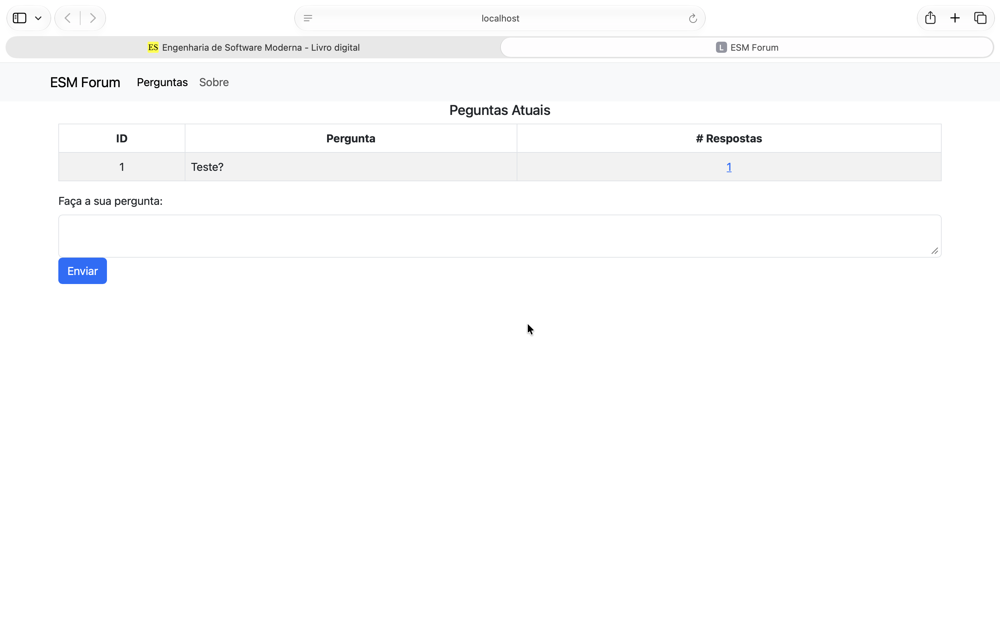

# Instalação e Execução do ESM Forum

Documentação do processo de configuração do ambiente de desenvolvimento do
**ESM Forum** (backend Node.js/Express/SQLite + frontend React), realizada como
parte da Tarefa 1 do Projeto Final da disciplina de Engenharia de Software.

- **Aluno:** Vinicius 
- **Modalidade:** individual
- **Ambiente utilizado:** macOS (Apple Silicon)

---

## 1. Repositórios

Foram criados forks dos dois repositórios oficiais do projeto:

| Componente | Repositório original | Fork utilizado neste trabalho |
|------------|---------------------|-------------------------------|
| Backend    | `jeffsantos/esmforum` | `Viny2106/esmforum` |
| Frontend   | `jeffsantos/esmforum-react` | `Viny2106/esmforum-react` |

> https://github.com/Viny2106/esmforum

O fork foi feito pela interface web do GitHub (botão **Fork**), mantendo apenas
a branch `main`.
 
---

## 2. Pré-requisitos

| Ferramenta | Versão utilizada | Como verificar |
|------------|------------------|----------------|
| Node.js    | `v20.15.0`      | `node --version` |
| npm        | `10.7.0`      | `npm --version` |
| SQLite     | nativo do macOS  | `sqlite3 --version` |
| Git        | `2.45.2`      | `git --version` |

### Observação sobre o ambiente macOS

A documentação oficial do repositório (`docs/instalacao.md`) instrui a instalar
o SQLite com `sudo apt install sqlite3`, comando específico de distribuições
Linux baseadas em Debian. **No macOS esse passo não é necessário**: o `sqlite3`
já vem incluído no sistema. Basta confirmar a presença dele com:

```bash
sqlite3 --version
```

Caso se queira uma versão mais recente que a do sistema, ela pode ser instalada
via Homebrew:

```bash
brew install sqlite
```

O Node.js pode ser instalado a partir do instalador oficial disponível em
<https://nodejs.org/en/download>, na versão LTS para arquitetura ARM64
(Apple Silicon).

---

## 3. Instalação e execução do backend

### 3.1 Clonagem do fork

```bash
git clone https://github.com/Viny2106/esmforum.git
cd esmforum
```

### 3.2 Instalação das dependências

```bash
npm install
```

Esse comando instala as dependências declaradas em `package.json`, entre elas o
**Express** (servidor web), o driver do **SQLite** e o **Jest** (testes).

### 3.3 Criação do banco de dados

O banco é um arquivo SQLite criado por um script auxiliar no diretório `bd`:

```bash
cd bd
./criar_bd.sh
cd ..
```

Se o script não tiver permissão de execução — situação comum após a clonagem em
macOS/Linux — o erro `permission denied` é resolvido com:

```bash
chmod +x criar_bd.sh
```

Esse mesmo script pode ser reexecutado sempre que se quiser "zerar" a base de
dados e voltar ao estado inicial.

### 3.4 Execução do servidor

No diretório raiz do projeto:

```bash
node server.js
```

O console indica a porta em que o servidor ficou escutando. Anote esse valor,
pois ele é necessário no passo seguinte.

- **Porta do backend:** `5000`
- **URL de teste:** `http://localhost:5000/`

> **Atenção (macOS):** a porta 5000 é usada por padrão pelo serviço AirPlay
> Receiver do macOS (visível como cabeçalho `Server: AirTunes` em uma
> resposta HTTP 403 vazia, caso apareça). Se o backend responder com 403 sem
> nenhum log do `node server.js` correspondente no console, desative o
> AirPlay Receiver em **Ajustes do Sistema > Geral > AirDrop e Handoff**
> antes de tentar de novo.

### 3.5 Execução dos testes automatizados

O repositório já traz testes de unidade e de integração escritos em Jest, no
diretório `testes`. Eles foram executados para confirmar que a instalação está
íntegra:

```bash
npm test
```

- **Resultado obtido:** 2 test suites (2 passed), 3 tests (3 passed), 0 snapshots, tempo de execução 0.406s. Todos os testes aprovados.

---

## 4. Instalação e execução do frontend

### 4.1 Clonagem do fork

Em um segundo terminal, e **fora** do diretório do backend:

```bash
git clone https://github.com/Viny2106/esmforum-react.git
cd esmforum-react
```

### 4.2 Instalação das dependências

```bash
npm install
```

### 4.3 Execução

```bash
npm start
```

**Importante:** o backend precisa estar em execução antes de se iniciar o
frontend, já que todas as telas consomem a API REST do servidor. Com o backend
parado, a aplicação abre mas nenhuma pergunta é listada.

### 4.4 Conflito de portas

Backend e frontend tentam ocupar a mesma porta padrão. Quando o backend já está
rodando, o `npm start` detecta que a porta está ocupada e pergunta se deve usar
outra porta — basta responder `Y`. O navegador abre automaticamente na porta
alternativa.

- **Porta do frontend:** `- **Porta do frontend:** `3000``

---

## 5. Verificação final do ambiente

O ambiente foi considerado corretamente configurado após a execução do seguinte
roteiro de validação manual:

1. Backend iniciado, respondendo na porta indicada no item 3.4.
2. Frontend iniciado e página inicial carregada no navegador.
3. Cadastro de uma nova pergunta pela interface.
4. Pergunta exibida na listagem da página inicial, confirmando a persistência no
   banco SQLite.
5. Cadastro de uma resposta para essa pergunta.
6. Contador de respostas da pergunta atualizado na listagem.
7. Reinício do backend e recarga da página, confirmando que os dados
   permaneceram salvos.

 
---

## 6. Problemas encontrados e soluções

Registro dos problemas enfrentados durante a configuração, mantido como parte da
documentação do processo:

| # | Problema | Causa | Solução aplicada |
|---|----------|-------|------------------|
| 1 | Instrução `sudo apt install sqlite3` não funciona | Comando é específico de Linux Debian; o ambiente de desenvolvimento é macOS | Verificado que o `sqlite3` já é nativo do macOS; passo dispensado |
| 2 | `npm install` falhava com `npm error code EEXIST` / `EACCES: permission denied` ao acessar `~/.npm/_cacache` | O cache global do npm ficou com dono/permissões incorretos (provavelmente de um uso anterior com `sudo`) | `sudo chown -R $(whoami) ~/.npm` seguido de `npm cache clean --force`, e então `npm install` novamente |
| 3 | Backend respondia `HTTP/1.1 403 Forbidden` vazio (cabeçalho `Server: AirTunes`) mesmo com `node server.js` rodando sem erros | O serviço AirPlay Receiver do macOS ocupa a porta 5000 por padrão, interceptando a requisição antes que ela chegasse ao servidor Node | Desativado o AirPlay Receiver em **Ajustes do Sistema > Geral > AirDrop e Handoff**; reiniciado o `node server.js` |


---

## 7. Estrutura do projeto

Visão geral da organização do código, obtida durante a etapa de compreensão do
sistema existente.

### Backend (`esmforum`)

```
esmforum/
├── server.js          # rotas HTTP da API (camada de controle)
├── modelo.js          # acesso ao banco SQLite (camada de modelo)
├── bd/                # script de criação do banco e arquivo .db
├── testes/            # testes de unidade e de integração (Jest)
├── public/            # arquivos estáticos
├── docs/              # documentação original do projeto
└── package.json       # dependências e scripts npm
```

Vale registrar que o enunciado do trabalho menciona os arquivos
`routes/perguntas.js` e `routes/respostas.js`, que **não existem nesta versão do
repositório**. Nela, as rotas de perguntas e de respostas estão todas em
`server.js`, e o acesso ao banco está concentrado em `modelo.js`. As análises
pedidas nas demais tarefas foram feitas, portanto, sobre esses dois arquivos.

### Frontend (`esmforum-react`)

```
esmforum-react/
├── src/
│   ├── index.js              # ponto de entrada da aplicação
│   └── Pages/
│       ├── Menu.js           # menu do topo da página
│       ├── Pergunta.js       # componentes Pergunta() e NovaPergunta()
│       ├── Resposta.js       # componentes Resposta() e NovaResposta()
│       └── Sobre.js          # página de informações do sistema
├── public/
├── docs/
└── package.json
```

---

## 8. Referências

- Repositório do backend: <https://github.com/jeffsantos/esmforum>
- Repositório do frontend: <https://github.com/jeffsantos/esmforum-react>
- Documentação original de instalação:
  <https://github.com/jeffsantos/esmforum/blob/main/docs/instalacao.md>
- Livro *Engenharia de Software Moderna*: <https://engsoftmoderna.info>
