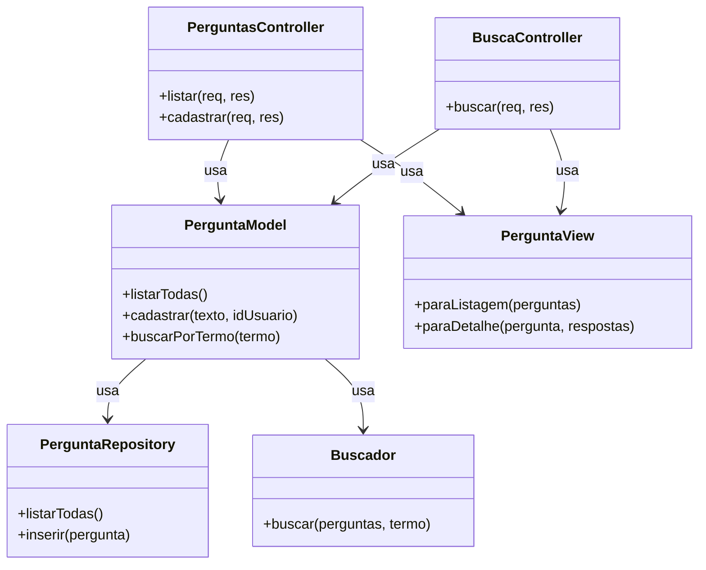

# Proposta de Organização Arquitetural — ESM Forum

Proposta de organização do código em camadas e de aplicação do padrão
MVC no backend, conforme a Tarefa 6 da Parte 3 do Projeto Final da
disciplina de Engenharia de Software.

- **Aluno:** Vinicius da Costa Chaves

---

## a) Proposta de Separação em Camadas

Hoje o backend é organizado em 3 arquivos únicos (`server.js`,
`modelo.js`, `bd/bd_utils.js`), o que funciona bem para o tamanho atual
do projeto, mas tende a ficar difícil de manter conforme mais
funcionalidades (votação, tags, busca) forem crescendo dentro do mesmo
`modelo.js`. A proposta abaixo separa essas responsabilidades em pastas
dedicadas, próximas da estrutura sugerida pelo próprio enunciado da
disciplina (`routes/`, `models/`).

### Camada de Apresentação (API routes)

**O que fica aqui:** os arquivos de rota HTTP. Recebem a requisição,
fazem validação superficial dos dados de entrada (ex.: campo obrigatório
presente, tipo correto), delegam para a camada de negócio, e traduzem o
resultado (ou erro) em uma resposta HTTP com o status code apropriado.
**Não** contêm lógica de negócio nem SQL.

**Responsabilidades específicas:**
- Definir as rotas (`GET /perguntas`, `POST /perguntas`,
  `GET /perguntas/busca`, etc.).
- Extrair dados de `req.params`, `req.query` e `req.body`.
- Chamar a camada de negócio correspondente.
- Formatar a resposta HTTP (`res.json`, `res.status`).

**Exemplos de módulos:**
- `routes/perguntas.routes.js`
- `routes/respostas.routes.js`
- `middlewares/tratadorDeErros.js` — um middleware central de erro,
  resolvendo a violação de OCP identificada em `ANALISE_SOLID.md` (hoje
  cada rota repete o mesmo `try/catch`).

### Camada de Negócio (lógica de aplicação)

**O que fica aqui:** as regras do domínio do fórum — validações,
orquestração de operações e aplicação dos padrões de projeto propostos
(Strategy para busca, Observer para notificação de mudanças, e o
Adapter para acesso a dados).

**Responsabilidades específicas:**
- Validar regras de negócio (ex.: texto da pergunta não pode ser vazio).
- Orquestrar operações que envolvem mais de uma entidade (ex.: registrar
  um voto e recalcular o total).
- Aplicar os algoritmos de busca (via `Buscador`, já implementado na
  Tarefa 2).
- Notificar interessados em mudanças (via Observer, proposto na Tarefa 4).

**Exemplos de módulos:**
- `services/perguntas.service.js`
- `services/busca.service.js` (envolve o `busca/buscador.js` já existente)
- `services/votos.service.js`

### Camada de Dados (acesso ao banco)

**O que fica aqui:** a tradução das operações de negócio em consultas
SQL concretas, e a comunicação direta com o SQLite (ou qualquer outro
banco, via o padrão Adapter proposto na Tarefa 4).

**Como seria estruturada:** um repositório por entidade, cada um
implementando a interface `RepositorioDados` (definida no Adapter da
Tarefa 4), para que a camada de negócio nunca dependa de uma
implementação concreta de banco.

**Exemplos de módulos:**
- `repositories/perguntas.repository.js`
- `repositories/respostas.repository.js`
- `adapters/sqlite.adapter.js` (o `bd_utils.js` atual, reorganizado atrás
  da interface `RepositorioDados`)

### Como as camadas se comunicariam

A comunicação segue sempre em uma direção, sem pular camadas:

```
routes/  -->  services/  -->  repositories/  -->  adapters/  -->  SQLite
```

Uma rota nunca chama um repositório diretamente, e um repositório nunca
conhece uma rota. Isso mantém cada camada testável isoladamente (como já
acontece hoje com os mocks em `testes/modelo.test.js` e
`testes/busca.test.js`) e é consistente com o diagrama arquitetural
apresentado em `ARQUITETURA.md` (Tarefa 5).

---

## b) Proposta de Aplicação do Padrão MVC

Aplicação do MVC para **2 funcionalidades já existentes no sistema**:
listagem/cadastro de perguntas e busca por palavra-chave (Tarefa 2 da
Parte 3) — escolhidas por já termos código de referência real para nos
basearmos, em vez de propor algo inteiramente hipotético.

### Models

**O que seria modelado:** um `PerguntaModel`, representando o conceito de
domínio "pergunta" (não a linha crua do banco). Ele expõe operações de
domínio, escondendo se por trás existe SQLite, Postgres, ou qualquer outro
mecanismo (via o Adapter da Tarefa 4):

- `PerguntaModel.listarTodas()` — retorna todas as perguntas cadastradas.
- `PerguntaModel.cadastrar(texto, idUsuario)` — cria uma nova pergunta.
- `PerguntaModel.buscarPorTermo(termo)` — retorna perguntas cujo texto
  contém o termo (reaproveita o `Buscador`/Strategy já implementado).

### Views

Como o ESM Forum é uma API (não uma aplicação que renderiza HTML no
servidor), a "Visão" no MVC do backend não é uma página, e sim **um
formatador de resposta JSON**: uma camada fina, responsável por decidir
exatamente qual formato de dado sai para o cliente, desacoplado do
formato interno do Model.

- `PerguntaView.paraListagem(perguntas)` — formato usado na tela
  principal (lista de perguntas + contagem de respostas).
- `PerguntaView.paraDetalhe(pergunta, respostas)` — formato usado na tela
  de detalhe de uma pergunta (a pergunta e todas as suas respostas juntas).

Essa separação permite, por exemplo, adicionar um campo novo ao
`PerguntaModel` (como `tags`, da História 2) sem que ele apareça
automaticamente em toda resposta JSON — só nas Views que explicitamente
decidirem incluí-lo.

### Controllers

Responsáveis por orquestrar a interação entre a requisição HTTP, o Model
e a View — sem conter lógica de negócio nem SQL:

- `PerguntasController.listar(req, res)` — chama
  `PerguntaModel.listarTodas()`, formata com
  `PerguntaView.paraListagem()`, envia a resposta.
- `PerguntasController.cadastrar(req, res)` — valida entrada básica,
  chama `PerguntaModel.cadastrar()`, retorna o id criado.
- `BuscaController.buscar(req, res)` — lê `req.query.termo`, chama
  `PerguntaModel.buscarPorTermo(termo)`, formata com
  `PerguntaView.paraListagem()`.

### Diagrama da estrutura MVC proposta

(arquivos-fonte: `diagrama_arquitetura/diagrama_mvc.mmd` /
`diagrama_mvc.png`)



### Exemplo de fluxo completo (requisição → resposta)

Fluxo de uma busca, `GET /perguntas/busca?termo=capital`:

1. O Express roteia a requisição para `BuscaController.buscar(req, res)`.
2. O Controller extrai `termo = req.query.termo` (nenhuma lógica de
   negócio acontece aqui, só leitura da requisição).
3. O Controller chama `PerguntaModel.buscarPorTermo(termo)`.
4. O Model chama `PerguntaRepository.listarTodas()`, que executa a query
   SQL (via o `SQLiteAdapter` proposto na Tarefa 4) e retorna as linhas
   brutas do banco.
5. O Model delega a filtragem em si ao `Buscador` (padrão Strategy, já
   implementado na Tarefa 2): `buscador.buscar(perguntas, termo)`.
6. O Model devolve ao Controller a lista já filtrada de perguntas
   (objetos de domínio, não linhas de banco).
7. O Controller passa esse resultado para
   `PerguntaView.paraListagem(perguntas)`, que monta o JSON final no
   formato esperado pela tela de listagem do frontend.
8. O Controller envia a resposta: `res.json(jsonFormatado)`.

Esse fluxo mantém cada camada com uma única responsabilidade — o
Controller nunca sabe como a busca é feita internamente, o Model nunca
sabe como a resposta HTTP é formatada, e a View nunca sabe de onde os
dados vieram.
